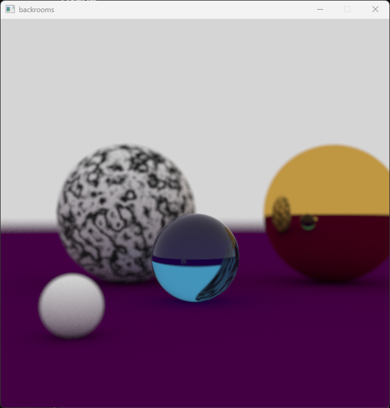

# Ray Tracing in Odin

### Was made for understanding principle of the ray tracing algorithm

***

## Build
Install Odin \
Run `odin run .`

***
## Usage

- Click **lmb** and drag mouse no rotate camera
- Click **mmb** to the object to focus
- **W, A, S, D, LShift, Space** to move camera (same as noclip)

***
## Preview

